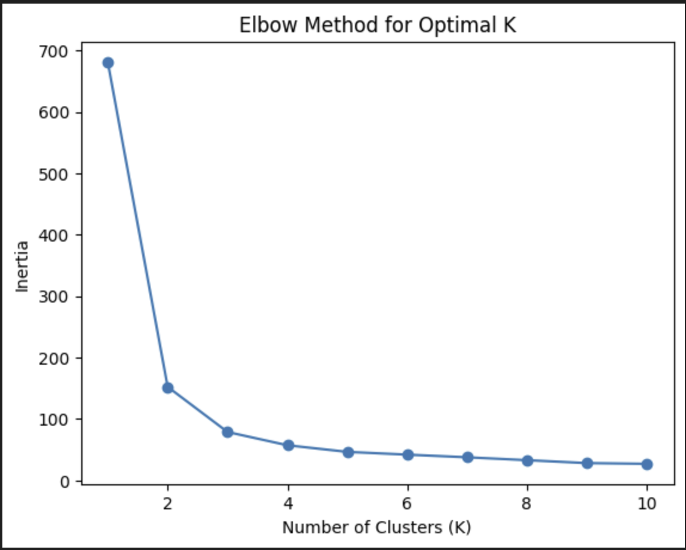

# Unsupervised Learning

Có hai loại chính:
*   **Phân cụm (Clustering):** Nhóm các điểm dữ liệu tương tự lại với nhau.
    *   *Ví dụ:* Phân khúc khách hàng, nhóm các bài báo theo chủ đề.
*   **Giảm chiều dữ liệu (Dimensionality Reduction):** Giảm số lượng các biến (đặc trưng) trong khi vẫn giữ lại thông tin quan trọng.
    *   *Ví dụ:* Nén ảnh, tăng tốc độ tính toán cho các thuật toán khác.

### Lời nguyền của Chiều dữ liệu (The Curse of Dimensionality)

Khi số lượng đặc trưng (chiều) của dữ liệu tăng lên, nhiều vấn đề có thể phát sinh:
-   **Tương quan giả (Spurious correlations):** Các đặc trưng có thể tương quan trong tập dữ liệu huấn luyện nhưng không có ý nghĩa trong thực tế.
-   **Nhiễu nhiều hơn tín hiệu (More noise than signal):** Các thuật toán khó có thể phân biệt được đâu là thông tin hữu ích và đâu là nhiễu.
-   **Yêu cầu dữ liệu lớn hơn:** Số lượng mẫu huấn luyện cần thiết tăng theo cấp số nhân với số chiều.
-   **Hiệu suất chậm hơn:** Việc xử lý nhiều cột hơn sẽ tốn kém về mặt tính toán.
-   **Tỷ lệ ngoại lệ (outliers) cao hơn:** Dữ liệu trở nên thưa thớt hơn, làm tăng khả năng xuất hiện các điểm ngoại lệ.

---

## Phân cụm K-Means (K-Means Clustering)

K-Means là một trong những thuật toán phân cụm đơn giản và phổ biến nhất. Nó hoạt động bằng cách lặp đi lặp lại để nhóm các điểm dữ liệu vào *K* cụm khác nhau.

### Quy trình hoạt động
1.  **Khởi tạo:** Chọn ngẫu nhiên *K* điểm dữ liệu làm các tâm cụm (centroids) ban đầu.
2.  **Gán cụm:** Với mỗi điểm dữ liệu, tính khoảng cách đến từng tâm cụm và gán điểm đó vào cụm có tâm gần nhất.
3.  **Cập nhật tâm cụm:** Tính toán lại vị trí của mỗi tâm cụm bằng cách lấy giá trị trung bình (mean) của tất cả các điểm dữ liệu đã được gán cho cụm đó.
4.  **Lặp lại:** Lặp lại bước 2 và 3 cho đến khi các tâm cụm không còn thay đổi vị trí nữa (thuật toán hội tụ).

### Nhược điểm
K-Means rất nhạy cảm với việc lựa chọn các điểm khởi tạo ban đầu. Các cấu hình khởi tạo khác nhau có thể dẫn đến các kết quả phân cụm khác nhau và có thể bị kẹt ở các điểm *tối ưu cục bộ (local optima)*.

---

## Khởi tạo K-Means: K-Means++

Để khắc phục nhược điểm của việc khởi tạo ngẫu nhiên, **K-Means++** được sử dụng để chọn các tâm cụm ban đầu một cách thông minh hơn, giúp thuật toán hội tụ tốt hơn.

### Quy trình hoạt động
1.  Chọn một điểm dữ liệu đầu tiên làm tâm cụm một cách ngẫu nhiên.
2.  Để chọn tâm cụm tiếp theo, hãy ưu tiên các điểm ở xa các tâm cụm đã chọn.
3.  Lặp lại bước 2 cho đến khi tất cả *K* tâm cụm đã được khởi tạo.

### Công thức
Xác suất để chọn một điểm làm tâm cụm tiếp theo được tính như sau:
*  
*  Trong đó, $D(\text{điểm}_i)$ là khoảng cách từ điểm *i* đến tâm cụm gần nhất đã được chọn.

---


## Lựa chọn số cụm phù hợp (Chọn K)

Để chọn số lượng cụm (K) tối ưu, chúng ta sử dụng các chỉ số đánh giá.

### Inertia (Quán tính)
*   **Định nghĩa:** Tổng bình phương khoảng cách từ mỗi điểm đến tâm cụm của nó.
*   **Ý nghĩa:** Giá trị Inertia càng nhỏ, các cụm càng chặt chẽ và cô đọng.
*   **Nhược điểm:** Inertia luôn giảm khi số cụm K tăng. Nếu K bằng số điểm dữ liệu, Inertia sẽ bằng 0.

### Distortion (Độ méo)
*   **Định nghĩa:** Trung bình của bình phương khoảng cách từ mỗi điểm đến tâm cụm của nó.
*   **Ý nghĩa:** Tương tự Inertia, giá trị Distortion nhỏ hơn tương ứng với các cụm chặt chẽ hơn.
*   **Ưu điểm:** Ít bị ảnh hưởng bởi số lượng điểm trong cụm hơn so với Inertia.

### Phương pháp Elbow (Elbow Method)
Đây là một kỹ thuật trực quan để tìm ra số cụm tối ưu:
1.  Chạy thuật toán K-Means với các giá trị K khác nhau (ví dụ: từ 1 đến 10).
2.  Với mỗi giá trị K, tính toán Inertia hoặc Distortion.
3.  Vẽ biểu đồ với K trên trục hoành và Inertia/Distortion trên trục tung.
4.  Chọn giá trị K tại **"điểm khuỷu tay" (elbow)** của biểu đồ, nơi mà tốc độ giảm của Inertia bắt đầu chậm lại đáng kể.

---

## Triển khai K-Means bằng Python

Sử dụng thư viện `scikit-learn` để triển khai K-Means.

### 1. Nhập và khởi tạo mô hình
```python
from sklearn.cluster import KMeans

# Khởi tạo mô hình với 3 cụm (K=3)
# init='k-means++' là phương pháp khởi tạo mặc định và được khuyến nghị
kmeans = KMeans(n_clusters=3, init='k-means++')
```

### 2. Huấn luyện và dự đoán
```python
# Huấn luyện mô hình trên dữ liệu X
kmeans.fit(X)

# Dự đoán nhãn cụm cho dữ liệu
predictions = kmeans.predict(X)

# Lấy nhãn của các cụm
labels = kmeans.labels_

# Lấy tọa độ của các tâm cụm
cluster_centers = kmeans.cluster_centers_
```

### 3. Triển khai phương pháp Elbow
```python
import matplotlib.pyplot as plt

inertias = []
list_num_clusters = list(range(1, 11))

for num_clusters in list_num_clusters:
    # Khởi tạo và huấn luyện mô hình cho mỗi số cụm
    km = KMeans(n_clusters=num_clusters)
    km.fit(X)
    
    # Lưu giá trị inertia
    inertias.append(km.inertia_)

# Vẽ biểu đồ elbow
plt.plot(list_num_clusters, inertias)
plt.scatter(list_num_clusters, inertias)
plt.xlabel('Number of Clusters (K)')
plt.ylabel('Inertia')
plt.title('Elbow Method for Optimal K')
plt.show()
```

### 4. Áp dụng cho phân đoạn màu sắc hình ảnh
```python
# image.shape ban đầu là (height, width, 3)
# Định hình lại để mỗi pixel là một hàng với 3 cột (R, G, B)
image_flat = image.reshape(image.shape[0] * image.shape[1], 3)

# Áp dụng K-Means để tìm 8 màu chủ đạo (K=8)
kmeans = KMeans(n_clusters=8)
kmeans.fit(image_flat)

# Lấy các màu của tâm cụm (8 màu chính)
new_colors = kmeans.cluster_centers_

# Tạo lại hình ảnh bằng cách thay thế mỗi pixel bằng màu của tâm cụm gần nhất
# ... (logic để thay thế các giá trị pixel)

# Định hình lại hình ảnh về kích thước ban đầu để hiển thị
new_image = new_image.reshape(image.shape)
plt.imshow(new_image)
plt.axis('off')
plt.show()
```

